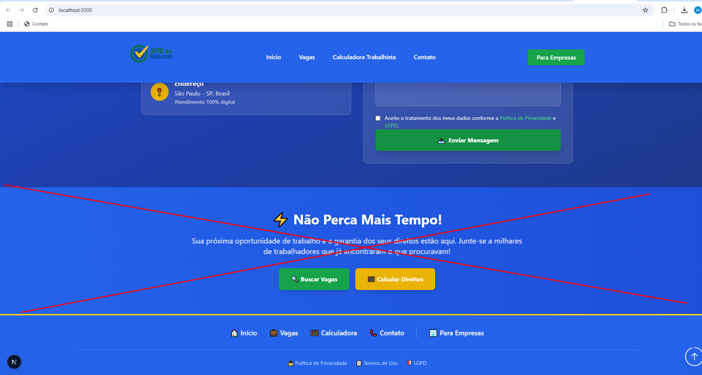

](image.png)# 🚀 GUIA RÁPIDO - COMO RODAR O BACKEND AGORA

## ⚡ Passos Simples (5 minutos)

### 1. Abrir Terminal no Backend
```bash
cd "c:\Users\leonardo.silva\Projetos\rzprospect\worker-job-board\SiteDoTrabalhador-backend"
```

### 2. Instalar Dependências (se não fez ainda)
```bash
npm install
```

### 3. Iniciar o Servidor
```bash
npm start
```

**✅ Pronto! O backend estará rodando em:** `http://localhost:3001`

## 🧪 Testar se Está Funcionando

### Opção 1: Teste Automático
```bash
npm run test-manual
```

### Opção 2: Testar no Navegador
Abra: `http://localhost:3001`

Deve mostrar:
```json
{
  "message": "API do Site do Trabalhador funcionando!",
  "features": [
    "Captura de leads completa",
    "Cache de vagas automático", 
    "Estatísticas em tempo real"
  ]
}
```

## 📊 Ver Dados Salvos

### Ver Leads (Formulários Preenchidos)
Abra: `http://localhost:3001/api/leads`

### Ver Vagas Ativas
Abra: `http://localhost:3001/api/vagas`

### Sincronizar Vagas Manualmente
```bash
curl -X POST http://localhost:3001/api/vagas/sync
```
ou abra: `http://localhost:3001/api/vagas/sync` no navegador

## 🔄 O Que Está Funcionando Automaticamente

1. **✅ Banco SQLite** - Criado automaticamente em `leads.db`
2. **✅ Sincronização de Vagas** - A cada 60 minutos
3. **✅ Captura de Leads** - Todos os dados do formulário
4. **✅ APIs REST** - Para frontend e admin
5. **✅ CORS Configurado** - Para funcionar com Next.js

## 🌐 Próximo Passo: Testar Frontend + Backend

1. **Backend rodando**: `http://localhost:3001` ✅
2. **Frontend rodando**: `http://localhost:3000` (em outro terminal)
3. **Integração**: Formulários do frontend salvam no backend

### Como Conectar Frontend ao Backend

O frontend já está configurado! Apenas certifique-se de que:
- Backend está em: `http://localhost:3001`
- Frontend está em: `http://localhost:3000`

## 🆘 Se Algo Der Errado

### Backend não inicia?
```bash
# Matar processo na porta 3001
npx kill-port 3001

# Tentar novamente
npm start
```

### Banco não funciona?
```bash
# Deletar banco e deixar recriar
rm leads.db
npm start
```

### Ver logs detalhados?
O terminal mostra todos os logs em tempo real quando você roda `npm start`.

## 🎯 Resumo do Status

- ✅ **Backend Express**: Configurado e funcionando
- ✅ **Banco SQLite**: Configurado automaticamente
- ✅ **APIs de Leads**: Recebem e salvam formulários
- ✅ **APIs de Vagas**: Sincronização automática
- ✅ **CORS**: Configurado para frontend
- ✅ **Deploy**: Pronto para produção (Render/Vercel)

**🔥 Agora é só rodar `npm start` e testar!**
